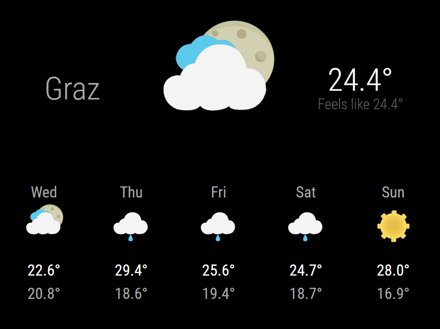

# MMM-DefaultWeatherAnimated

Adds animated icons and changes layout of default weather plugin

I did not find any weather plugin with nice animated icons that fitted my needs.
So I took the default one and changed it a little ;)

## Preview

## Installation
Setup Default Weather Module
Copy and override files
* icons.css -> MagicMirror/modules/default/weather/   (copy)
* forecast.njk -> MagicMirror/modules/default/weather/    (override)
* current.njk -> MagicMirror/modules/default/weather/   (override)
* weather.js -> MagicMirror/modules/default/weather/    (override)

created with Icons from:
https://codepen.io/boosmoke/pen/XegXaW

I know changeing files of another module is mot the best solution but it was the easiest for me.
